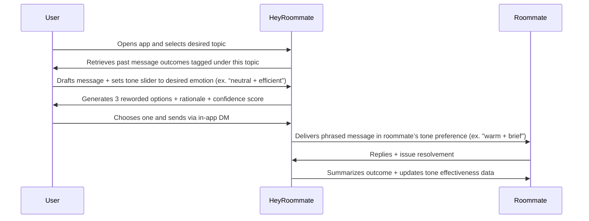

## _HeyRoommate_ Workflow

```mermaid
sequenceDiagram
participant User
participant HeyRoommate
participant Roommate

User->>HeyRoommate: Opens app and selects desired topic
HeyRoommate->>User: Retrieves past message outcomes tagged under this topic
User->>HeyRoommate: Drafts message + sets tone slider to desired emotion (ex. “neutral + efficient”)
HeyRoommate->>User: Generates 3 reworded options + rationale + confidence score
User->>HeyRoommate: Chooses one and sends via in-app DM
HeyRoommate->>Roommate: Delivers phrased message in roommate’s tone preference (ex. "warm + brief")
Roommate->>HeyRoommate: Replies + issue resolvement
HeyRoommate->>Roommate: Summarizes outcome + updates tone effectiveness data

```