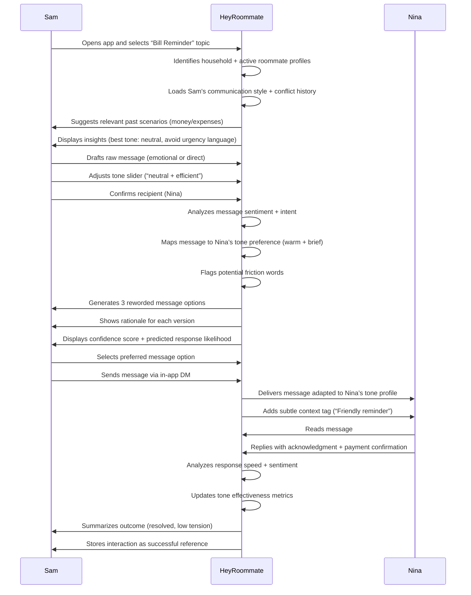

## Situation Workflow For Testing

```mermaid
sequenceDiagram
participant Sam
participant HeyRoommate
participant Nina

Sam->>HeyRoommate: Opens app and selects “Bill Reminder” topic
HeyRoommate->>HeyRoommate: Identifies household + active roommate profiles
HeyRoommate->>HeyRoommate: Loads Sam's communication style + conflict history

HeyRoommate->>Sam: Suggests relevant past scenarios (money/expenses)
HeyRoommate->>Sam: Displays insights (best tone: neutral, avoid urgency language)

Sam->>HeyRoommate: Drafts raw message (emotional or direct)
Sam->>HeyRoommate: Adjusts tone slider (“neutral + efficient”)
Sam->>HeyRoommate: Confirms recipient (Nina)

HeyRoommate->>HeyRoommate: Analyzes message sentiment + intent
HeyRoommate->>HeyRoommate: Maps message to Nina’s tone preference (warm + brief)
HeyRoommate->>HeyRoommate: Flags potential friction words

HeyRoommate->>Sam: Generates 3 reworded message options
HeyRoommate->>Sam: Shows rationale for each version
HeyRoommate->>Sam: Displays confidence score + predicted response likelihood

Sam->>HeyRoommate: Selects preferred message option
Sam->>HeyRoommate: Sends message via in-app DM

HeyRoommate->>Nina: Delivers message adapted to Nina’s tone profile
HeyRoommate->>Nina: Adds subtle context tag (“Friendly reminder”)

Nina->>HeyRoommate: Reads message
Nina->>HeyRoommate: Replies with acknowledgment + payment confirmation

HeyRoommate->>HeyRoommate: Analyzes response speed + sentiment
HeyRoommate->>HeyRoommate: Updates tone effectiveness metrics

HeyRoommate->>Sam: Summarizes outcome (resolved, low tension)
HeyRoommate->>Sam: Stores interaction as successful reference

```
